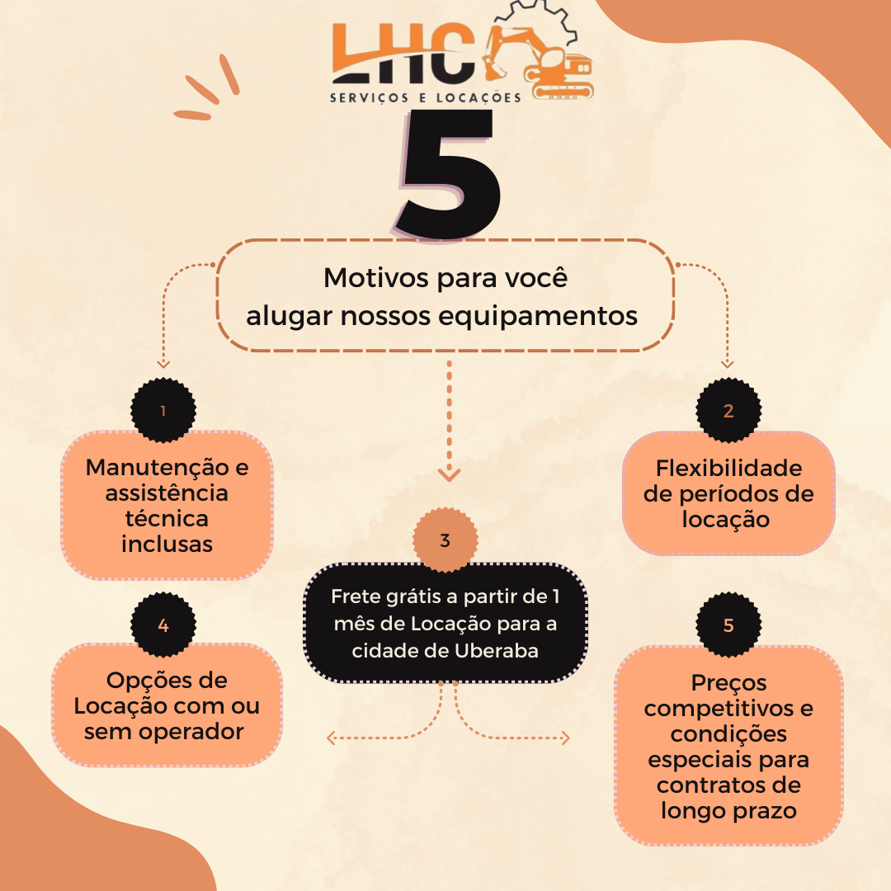
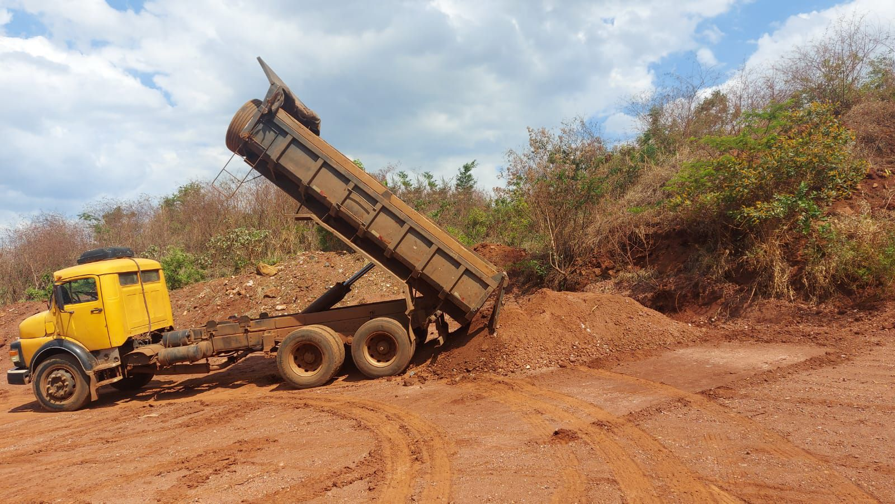

<!DOCTYPE html>
<html lang="pt-br">
<head>
    <meta charset="UTF-8">
    <meta name="viewport" content="width=device-width, initial-scale=1.0">
    <meta name="description" content="LHC Serviços e Locações - Locação de escavadeiras e caminhões basculantes.">
    <meta name="keywords" content="locação de equipamentos, escavadeiras, caminhões basculantes, terraplenagem">
    <meta name="author" content="LHC Serviços e Locações">
    <title>LHC Serviços e Locações</title>
    
        </head>
        <body>
    <!-- Cabeçalho com imagem de destaque -->
    <header>
        <h1>LHC Serviços e Locações</h1>
        
Especialistas em Locação de Escavadeiras e Caminhões Basculantes

        <button class="cta-button">Solicite um Orçamento Agora</button>
    </header>

    <!-- Navegação -->
    <nav>
        <a href="#inicio">Página Inicial</a>
        <a href="#sobre">Sobre Nós</a>
        <a href="#servicos">Serviços</a>
        <a href="#equipamentos">Equipamentos</a>
        <a href="#orcamento">Solicitação de Orçamento</a>
        <a href="#contato">Contato</a>
    </nav>

    <!-- Seções do site -->
    <section id="inicio">
        <h2>Bem-vindo à LHC Serviços e Locações</h2>
        
Oferecemos soluções completas em locação de equipamentos pesados para atender às necessidades de construção civil, infraestrutura, mineração e terraplenagem.

    </section>

    <section id="sobre">
        <h2>Sobre Nós</h2>
        
Fundada em 2022, a LHC Serviços e Locações é referência no mercado de locação de equipamentos pesados. Nossa missão é oferecer qualidade, eficiência e segurança em cada projeto, sempre priorizando a satisfação dos nossos clientes.

    </section>

    <section id="servicos">
        <h2>Nossos Serviços</h2>
        <ul>
            <li>✔ Locação de escavadeiras modernas e eficientes</li>
            <li>✔ Locação de caminhões basculantes para transporte de materiais</li>
            <li>✔ Equipamentos para terraplenagem e obras de infraestrutura</li>
            <li>✔ Manutenção Preventiva In Loco</li>
        </ul>
        
    </section>

    <section id="equipamentos">
        <h2>Equipamentos</h2>
        
Confira nossa linha de equipamentos de alta performance disponíveis para locação:

        <ul>
            <li>Escavadeiras hidráulicas</li>
            <li>Caminhões basculantes</li>
            <li>Caminhão 3/4 carroceria</li>
        

            
            
            
            
            
        

    </section>
    <section id="orcamento">
        <h2>Solicitação de Orçamento</h2>
        <form>
            <label for="nome">Nome:</label>
            <input type="text" id="nome" name="nome" placeholder="Seu nome completo" required>
            
            <label for="email">E-mail:</label>
            <input type="email" id="email" name="email" placeholder="Seu e-mail" required>

            <label for="telefone">Telefone:</label>
            <input type="tel" id="telefone" name="telefone" placeholder="Seu telefone">
            
            <label for="mensagem">Mensagem:</label>
            <textarea id="mensagem" name="mensagem" rows="5" placeholder="Descreva o serviço ou equipamento necessário"></textarea>
            
            <button type="submit">Enviar Solicitação</button>
        </form>
    </section>

    <section id="contato">
        <h2>Contato</h2>
        
Entre em contato conosco para mais informações:

        <ul>
            <li><strong>Telefone:</strong> (34) 99199-9095</li>
            <li><strong>E-mail:</strong> leandrocrds.eng@gmail.com</li>
            <li><strong>Endereço:</strong> Rua Santa Catarina, 373, Uberaba-MG</li>
        </ul>
        

            
            
        

    </section>

    <footer>
        
&copy; 2025 LHC Serviços e Locações. Todos os direitos reservados.

    </footer>

    <!-- Botão de Voltar ao Topo -->
    <button id="back-to-top">↑</button>

    
</body>
</html>
